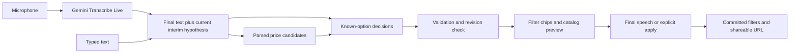

# Structured decisions and live voice filters

Shop implements typed and spoken live filters under
[Intelligence Without Waiting](LATENCY_SPEC.md). The browser shows speculative filters and
matching products as input changes; Apply or finalized speech commits resolved filters to the URL.

## Capability routing

| Work                                                               | Service / implementation            | Output                            |
| ------------------------------------------------------------------ | ----------------------------------- | --------------------------------- |
| Direct selection, validation, price parsing and set operations     | Application code                    | Exact filter state                |
| Known categories, colour families, aesthetics, department and sort | TypeSafe `jev-1.13.0`               | Validated Choice decisions        |
| Construction facets the sentence names (material … design detail)  | TypeSafe `jev-1.13.0`               | Choice per lexical candidate      |
| Whether the sentence names a motif, character, brand or slogan     | TypeSafe `jev-1.13.0`               | One Noul (`freeText`)             |
| English full-text keywords for such a sentence                     | Fast generative model (`getLlm`)    | `keywords`, after the preview     |
| Streaming microphone audio                                         | Gemini `gemini-3.5-transcribe-live` | Interim and finalized transcripts |
| Sentence parsing: catalog attributes, occasion, season, department | TypeSafe `jev-1.13.0`               | Intent slots (ENGINE_SPEC §1.3)   |
| Say it sentences the decision cannot finish (reference, recipient) | Luna / Gemini Flash-Lite            | Intent and suggestions            |
| Edition artwork                                                    | Flare / Gemini image                | Generated image                   |

Jev uses `POST https://api.typesafe.ai/v1/systemone`, batching independent questions. It is separate
from generative provider routing; a failed partial never silently invokes a general-purpose LLM.
`TYPESAFE_API_KEY` enables semantic filtering and `TYPESAFE_MODEL` overrides the pinned model.
`GEMINI_API_KEY` additionally enables voice. Manual controls remain available without either key.
[TypeSafe API](https://docs.typesafe.ai/api) · [Model versions](https://docs.typesafe.ai/models)

## Decision contract

`POST /api/filters/resolve` accepts `{ utterance, base, revision }`. The utterance is limited to
500 characters. `base` contains only allowed filter fields and catalog values. The response is
`{ filters, unresolved, hints, freeText, revision, model, contractVersion, latencyMs }`;
`filters-v3` identifies this question/reduction contract (`v2` added `hints`, `v3` the registry
facets, lexical candidates and `freeText`). The model sees the utterance as data, with any
existing facet values embedded in its relevant operation question.

The filters are the `SEARCH_FACETS` registry of `@lookline/catalog` — one table that the form,
the URL, the API validation, the decision questions and the SQL all read. Three facets are
`semantic`: the catalog supplies every category group, colour family and aesthetic, including
bilingual labels and named colours within each family, and Jev chooses include, exclude or
neutral for each. Navy maps to the blue family; this is a family-level filter, not exact-colour
matching. The ten construction facets — material, pattern, print subject, silhouette, fit,
length, neckline, sleeve, closure and design detail — are `lexical`: `extractFacetCandidates`
finds the values whose bilingual terms are literally in the sentence ("A 字裙", "蕾絲邊",
"cartoon print"; longest match wins its span, so the "lace" in "lace trim" is not also a
material), and only those values are put to Jev, each with its listed names, as the same
include / exclude / neutral choice. A word Jev judges to mean something else — "long" in "a
silk long coat" — is neutral and constrains nothing; an unsure one leaves that facet unresolved.
When a facet already has filters, a separate question distinguishes replace, add, clear and keep.
Code reconciles those choices: new positive selections replace by default, explicit additions
union selections, exclusions remove conflicting inclusions, and an exclusion-only request retains
other selections. Unmentioned facets stay unchanged. An exclusion never claims an unknown: "not
lace trim" drops the articles tagged with lace trim and keeps the ones the vision pass has not
described, in the SQL as in the chips.

One Noul question, `freeText`, asks whether the sentence names something the attributes cannot
carry — a motif, a character, a brand, a slogan. Jev cannot say which word, and must not: the
answer only gates `POST /api/filters/keywords` `{ utterance, revision }`, where the fast
generative model (`getLlm`, Flash-Lite in production) turns those words into up to four concepts
of up to three terms each — the English word, a plural or synonym, and the Chinese term when the
request was Chinese (`whale|whales|鯨魚`) — sanitised to index tokens with anything the catalog
vocabulary already expresses removed. They travel as repeated `keywords` URL fields, AND-ed
against the FTS5 index over names, copy, print motifs and the photograph captions in both
languages (a Chinese term is a phrase over its spaced characters), without a lexicon pass. The attribute preview never waits for them: the browser paints
the resolved filters and their products first, asks for keywords 500 ms after the sentence
stops changing (at once on Apply or final speech), and narrows the grid when they land — a
committed sentence updates its URL in place. A keyword answer for a sentence that has since
changed, or for a search the shopper has since changed by hand, is dropped by the revision
check; a sentence that still names its motif keeps the keywords its earlier revision found until
the fresh ones replace them. No provider is a quiet outcome — the attribute results stand.

Price candidates come from the existing deterministic parser, including separate correction
clauses. Jev selects a parsed candidate, clear, keep or uncertain. It does not invent numbers or
perform currency arithmetic. The schema rejects invalid bounds and contradictory sets.
[Known numeric limitations](https://docs.typesafe.ai/model-jaggedness/jev-1.13)

The adapter validates the full option set, probability ranges and sum, and that the selected
option has maximum probability. Mutating decisions require Choice confidence ≥ 0.8 and selected
probability ≥ 0.9. Keep and neutral do not mutate state and need no threshold. A low-confidence
proposed selection retains that entire facet and reports it as unresolved; unrelated resolved
facets can still preview. These initial thresholds require broader bilingual calibration.
A well-typed answer is not proof of semantic correctness.
[Choice contract](https://docs.typesafe.ai/primitives/choice) ·
[Confidence](https://docs.typesafe.ai/confidence)

Noul and Score are available future primitives for independent binary judgments and graded
compatibility. The current filter adapter uses Choice only.

## Hints

The line under the sentence field is a question, not a diagnosis: "What is the occasion?",
"Who is it for?", "Budget?", each with a row of answers. `packages/engine/src/decisions/hints.ts`
holds 28 hints in priority order — recipient, occasion, formality, four occasion follow-ups
(wedding role, office type, destination, activity), category, budget, colour, seven garment
follow-ups (warmth, length, sleeve, trouser cut, heel, bag size, neckline), mood, fit, season,
avoided colour, fabric, pattern, ordering, time of day, pairing, care, statement. Each hint is one
Choice question batched into the same Jev request as the filter questions: `stated` or `missing`,
plus `inapplicable` for follow-ups that only apply in context (a wedding, a dress). A hint whose
answer the current filters already carry (department, category, colour, budget, aesthetics, sort)
is not asked. The reduction keeps hints Jev judged `missing` with confidence ≥ 0.5, in priority
order; an absent answer or an unexpected choice drops the hint. Hints never mutate filter state and
never raise an error. The internal `unresolved` list still gates the commit but is not shown.

The browser shows one question at a time: the first open hint the shopper has not skipped. Before
the first decision (an empty or just-started sentence) it shows the context-free hints the filters
leave open, starting with "Who is it for?". Choosing an answer appends it as the sentence's next
clause — English by default, Chinese once the sentence is mostly CJK ("黑色洋裝，參加婚禮") — and
the ordinary 200 ms decision loop reads the whole sentence again, so the next question follows
from Jev's answer, not from a script. Question copy and answer phrases live in
`apps/web/src/components/shop/hints.ts`. Occasion and recipient answers do not yet move a filter
(the resolver only acts on explicitly named options); they enrich the sentence for a later
purpose-aware compiler.

## Streaming interaction

1. Input text paints immediately. The decision queue coalesces input over 200 ms, keeps at most
   one active request and only the newest queued revision. It does not wait for speech to stop.
2. Each request resolves the complete current utterance against the snapshot taken when the
   interaction began. It does not accumulate speculative patches.
3. A current response updates labelled preview chips, then fetches catalog results independently.
   Previous products remain visible while newer results load. Older responses cannot overwrite
   newer input, even if transport cancellation loses a race.
4. Finalized speech or Apply performs final reconciliation. Fully resolved decisions commit to
   the URL; unresolved facets stay at their prior values with a clarification message. The user
   may explicitly accept resolved filters or discard the preview.
5. Manual filter links and sort edits invalidate pending decisions and end voice capture. Browser
   back/forward navigation restores URL filters. Cancel restores the latest committed state.
6. Interim changes do not persist intent sessions, impressions or preference feedback. Network
   errors preserve usable products and expose retry. Requests exceeding 500 characters stop
   automatic interpretation and ask the user to review or shorten them.

For “黑色外套……不要黑色，改成海軍藍，三千以內”, the corrected preview removes black,
selects blue, excludes black and applies an exact TWD 3000 ceiling.

## Audio and service boundaries

Voice languages default to Traditional Chinese (Taiwan, `cmn-Hant-TW`) and English (`en-US`).
The multi-select also offers Japanese, Korean, Cantonese, French, German and Spanish. At least one
language remains selected; the browser remembers the choice locally. Capture snapshots the selection
and disables language edits until it stops. Both the token constraints and Live setup receive the
same language codes. Invalid or empty selections return HTTP 400 before token issuance.
Gemini's documentation describes multi-language hints; `cmn-Hant-TW` was additionally accepted by a
real Live setup on 2026-09-18, although the published language table lists only simplified Mandarin.

Pressing Speak requests microphone permission. The server authenticates the session and issues a
single-use Gemini token, constrained to the transcription model and TEXT response modality. It
allows connection within 60 seconds and expires after five minutes. The installed SDK uses
`v1alpha` for ephemeral-token connections; permanent keys stay on the server.

An AudioWorklet emits mono, 16-bit little-endian PCM at 16 kHz in 100 ms packets.
`interimInputTranscription` replaces the current hypothesis. `inputTranscription` contributes
finalized fragments; `finished: false` delays segment commit. Normal Stop releases microphone
tracks, flushes buffered PCM, sends `audioStreamEnd` and allows 2.5 seconds for final transcription.
Cancel closes immediately. Connection setup has a 10-second deadline. Errors, expiry and
navigation release audio tracks, the audio graph, timers and the socket.
[Gemini live transcription](https://ai.google.dev/gemini-api/docs/live-api/live-transcribe)

Both endpoints require authenticated, same-origin POSTs. Prototype limits are process-local:
300 filter requests and six voice-token requests per user per minute, with one active request per
capability. Shopping Jev and keyword calls have a 15-second provider deadline; browser requests for
filters, keywords, products and facet counts have a 20-second deadline. New input still supersedes older decisions; manual edits
cancel pending work immediately. These are failure ceilings, not latency targets. These limits must become shared limits before
multi-instance deployment. Audio and transcripts are not persisted by Lookline; provider data
handling remains governed by the configured service account.

`ProductSearch`, SQL, URL encoding and controls share plural inclusion and exclusion arrays.
Values within one included facet use OR; different facets use AND. Exclusions are enforced by SQL.
The canonical URL repeats every registry pair (`categoryGroups` … `details` and their
`excluded…` counterparts) and `keywords`. There is no singular-parameter compatibility path.

The rail's fixed groups (category, colour, style, price) show counts from the search itself; the
construction facets appear as folded rows only for the categories they can describe (no sleeve
row over bags) and count their values when opened, through
`GET /api/articles/facets?facet=<id>&…`, so a value is offered only once the current results
are known to hold it. The product page reads the same vocabularies for its detail table.

## Verification and performance

Unit coverage includes request/response validation, uncertain mutations, exact prices, multi-value
SQL filtering, URL round-trips, transcript replacement and serialized request revisions.
`scripts/qa/live-filters-browser.ts` exercises a real catalog with controlled model events and a
synthetic browser microphone. It separately probes real Jev and Gemini service access.
With `QA_VOICE_WAV` pointing to a 16 kHz mono PCM WAV, it also checks real speech through both
services. On 2026-09-18, a synthesized English sentence transcribed as “black outerwear under 3000
Taiwan dollars” and produced the outerwear, black and TWD 3000 filter chips. The fixture includes
leading silence so speech starts after connection setup. A later smoke test with the default Traditional Chinese + English hints transcribed synthesized
Mandarin as “我想要海軍藍外套，預算 3000 元以內。” and updated the category and price filters.
Chinese ASR accuracy has not been benchmarked; correction behavior was also checked with real Jev
and controlled transcript events.
`scripts/qa/jev-smoke.ts` covers bilingual corrections, negation, alternatives and existing filters.
`scripts/qa/attribute-filters-smoke.ts` covers the construction facets and the free-text signal:
on 2026-09-20 real Jev resolved "A 字裙" / "an a-line skirt" to `silhouettes: [a-line]` (and
bottoms), "有口袋、不要蕾絲邊" / "with pockets, no lace trim" to `details: [pockets]` with
`excludedDetails: [laceTrim]`, "卡通印花上衣" / "cartoon print top" to tops with
`printSubjects: [character]`, "改成長袖" over `sleeves: [short]` to `sleeves: [long]`, and
"a silk long coat" to `materials: [silk]` with the sleeve left alone; "鯨魚圖案的上衣" and "a
whale print hoodie" came back `freeText: true` (0.91) and every attribute-only sentence
`false` (≤ 0.22), in 300–1 140 ms per call. `scripts/qa/keywords-smoke.ts` then had the
configured model return `whale|whales|鯨魚`, `dinosaur|dinosaurs|恐龍`, `hello kitty|凱蒂貓` and
`good vibes only`, and nothing for an attribute-only sentence, in 1.2–2.4 s; against the live
catalogue `keywords=鯨魚` finds 31 articles and `whale|鯨魚` 48. As before, these are smoke runs,
not an accuracy benchmark.

Real Jev runs on 2026-09-18 resolved the English multi-colour request, Chinese correction and mixed
language example with no unresolved fields. The three-request run took 303–939 ms per provider
call. Add, replace and clear examples also resolved; some unrelated scalar questions abstained
on a price-only request. These small smoke tests are not an accuracy benchmark or latency SLA.

Browser `lookline:filters` events report revision, model, decision time, filter paint time and
product paint time without utterance or audio content. Targets remain:

- Control acknowledgement ≤ 100 ms; manual filter paint ≤ 400 ms.
- Transcript revision received → filter preview p95 ≤ 400 ms.
- Transcript revision received → usable product preview p95 ≤ 800 ms.

The measured provider calls alone already exceed the filter target in some cases. Full audio-to-
transcript, audio-to-filter and final-to-commit latency still need representative measurement,
including Chinese, English, interruptions and network variability. No end-to-end speed guarantee
is established. Broader labelled evaluation should report precision/recall, abstention, correction
accuracy, p50/p95 latency and cost before expanding this route beyond Shop.

The sentence toolbar links to `/shop-talk`, carrying the currently displayed filter conditions
and starting at page 1. The experimental label is localized; no draft sentence is put in the URL.
